Практична робота № 3

-----
## **Завдання 3.1:** 
Запустіть Docker-контейнер і поекспериментуйте з максимальним лімітом ресурсів відкритих файлів. Для цього виконайте команди у вказаному порядку:

$ ulimit -n

$ ulimit -aS | grep "open files"

$ ulimit -aH | grep "open files"

$ ulimit -n 3000

$ ulimit -aS | grep "open files"

$ ulimit -aH | grep "open files"

$ ulimit -n 3001

$ ulimit -n 2000

$ ulimit -n

$ ulimit -aS | grep "open files"

$ ulimit -aH | grep "open files"

$ ulimit -n 3000

Як наступне вправу, повторіть перераховані команди з root-правами.

----- 
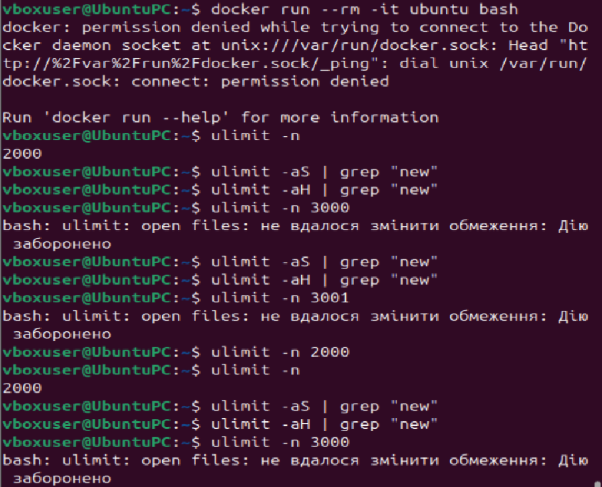

Рис 1. Запуск докера та виконання команд.

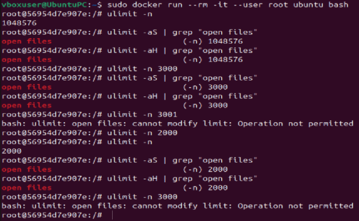

Рис 2. Запуск докера та виконання команд з правами root.-----
## **Завдання 3.2:** 
У Docker-контейнері встановіть утиліту perf(1). Поекспериментуйте з досягненням процесом встановленого ліміту.

-----
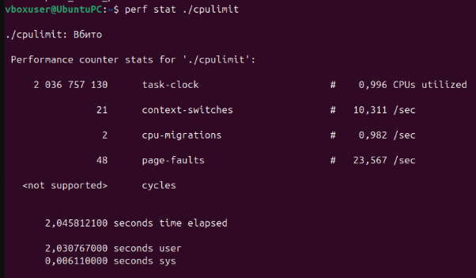

Рис 3. виконання утиліти perf після досягнення ліміту процесору

-----
## **Завдання 3.3:** 
Напишіть програму, що імітує кидання шестигранного кубика. Імітуйте кидки, результати записуйте у файл, для якого попередньо встановлено обмеження на його максимальний розмір (max file size). Коректно обробіть ситуацію перевищення ліміту.

-----

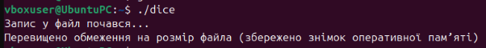

Рис 4. скомпільована програма dice.c,та успішно виконана програма.

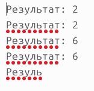

Рис 5. файл dice.txt, наслідки обмеження буферу.

-----
## **Завдання 3.4:** 
Напишіть програму, що імітує лотерею, вибираючи 7 різних цілих чисел у діапазоні від 1 до 49 і ще 6 з 36. Встановіть обмеження на час ЦП (max CPU time) і генеруйте результати вибору чисел (7 із 49, 6 із 36). Обробіть ситуацію, коли ліміт ресурсу вичерпано.

-----

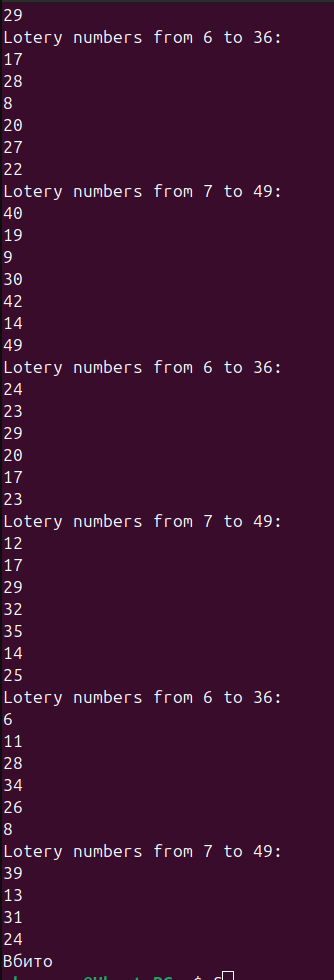

Рис 6. скомпільована програма lotery.c, та раптова зупинка програми після досягнення ліміту.

-----
## **Завдання 3.5:** 
Напишіть програму для копіювання одного іменованого файлу в інший. Імена файлів передаються у вигляді аргументів.

-----
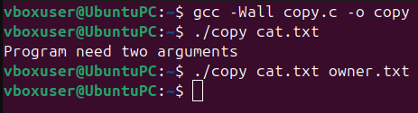

Рис 7. компіляція програми copy.c, успішна передача даних.

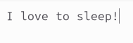

Рис 8. файл cat.txt з початковим текстом для копіювання.

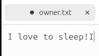

Рис 9. файл owner.txt з скопійованим текстом.

-----
## **Завдання 3.6:** 
Напишіть програму, що демонструє використання обмеження (max stack segment size). Підказка: рекурсивна програма активно використовує стек.

-----
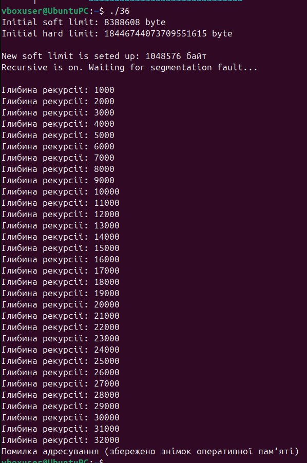

Рис 10. компіляція програми 36.с з обмеженням (max stack segment size).

-----
## **Завдання ПО ВАРІАНТАХ**
10\. Написати сценарій, що тестує всі ulimit обмеження в одному виконанні.

-----
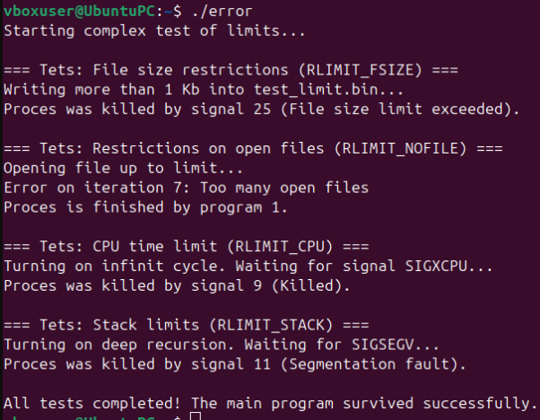

Рис 11. компіляція програми error.c для перевірки усіх обмежень ulimit.
