## **Завдання 4.1:** 

Скільки пам'яті може виділити malloc(3) за один виклик?

Параметр malloc(3) є цілим числом типу даних size_t, тому логічно
максимальне число, яке можна передати як параметр malloc(3), --- це
максимальне значення size_t на платформі (sizeof(size_t)). У 64-бітній
Linux size_t становить 8 байтів, тобто 8 \* 8 = 64 біти. Відповідно,
максимальний обсяг пам'яті, який може бути виділений за один виклик
malloc(3), дорівнює 2\^64. Спробуйте запустити код на x86_64 та x86.
Чому теоретично максимальний обсяг складає 8 ексабайт, а не 16?

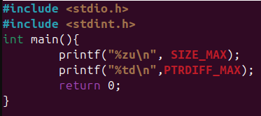{width="3.8854166666666665in"
height="1.7291666666666667in"}

Рис 1. Запуск програми 41.с, по виводу розмірів size_t та ptrdiff_t.

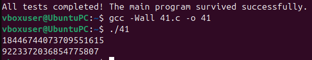{width="6.267716535433071in"
height="1.2083333333333333in"}

Рис 2. Компіляція програми, та вивід розмірів зміних size_t, ptrdiff_t.

### **Відповідь на запитання:**

Усе через зміну ptrdiff_t яка відповідає за операції між показниками.
Змінна є знаковим типом даних, через це вона забирає один біт з
загальної пам'яті під знак перед числом.

## **Завдання 4.2:** 

Що станеться, якщо передати malloc(3) від'ємний аргумент? Напишіть
тестовий випадок, який обчислює кількість виділених байтів за формулою
num = xa \* xb. Що буде, якщо num оголошене як цілочисельна змінна зі
знаком, а результат множення призведе до переповнення? Як себе поведе
malloc(3)? Запустіть програму на x86_64 і x86.

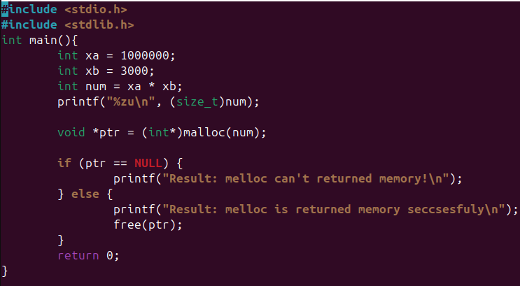{width="6.267716535433071in"
height="3.4444444444444446in"}

Рис 3. Код пргорами 42.с

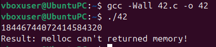{width="4.447916666666667in"
height="0.9791666666666666in"}

Рис 4. Скомпільована програма на Х86_64 архітектурі.

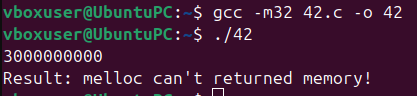{width="4.34375in" height="1.0in"}

Рис 5. Скомпільована програма на Х86 архітектурі.

### **Відповідь на запитання:**

Якщо від\'ємний, то нічого не станеться розмір з від'ємного
конвертується в позитивний. Натомість, якщо число перебільшує нижню
межу(тобто відємну). 32 бітна система буде перевантажена і тому не може
виділити пам'ять. Таке саме число на 64 бітній системі пам'ять
виділиться без проблем.

## **Завдання 4.3:** 

Що станеться, якщо використати malloc(0)? Напишіть тестовий випадок, у
якому malloc(3) повертає NULL або вказівник, що не є NULL, і який можна
передати у free(). Відкомпілюйте та запустіть через ltrace. Поясніть
поведінку програми.

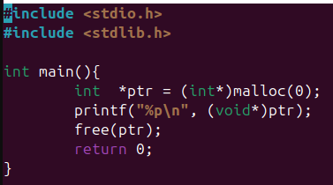{width="3.9270833333333335in" height="2.1875in"}

Рис 6. Код програми 43.с.

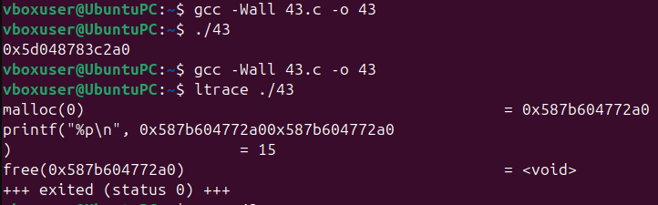{width="6.267716535433071in"
height="1.9583333333333333in"}

Рис 7. Скомпільована програма з використанням утиліти ltrace.

### **Відповідь на запитання:**

Система все одно викличе пам'ять для можливих подальших операцій.

## **Завдання 4.4:** 

Чи є помилки у такому коді?

void \*ptr = NULL;

while (\<some-condition-is-true\>) {

if (!ptr)

ptr = malloc(n);

\[\... \<використання \'ptr\'\> \...\]

free(ptr);

}

Напишіть тестовий випадок, який продемонструє проблему та правильний
варіант.

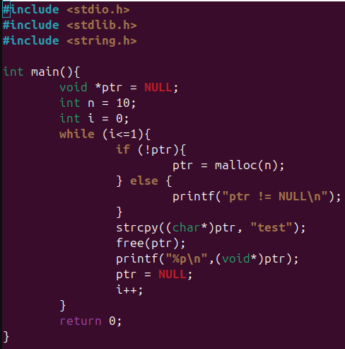{width="5.083333333333333in"
height="5.135416666666667in"}

Рис 8. Код програми 44.с.

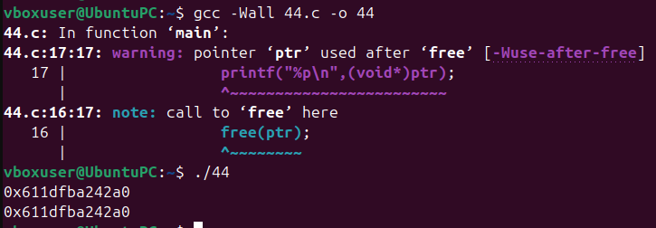{width="6.267716535433071in"
height="2.1805555555555554in"}

Рис 9. Виконання програми.

### **Відповідь на запитання:**

Якщо ми ініціалізуємо пам'ять під NULL то вона виділиться, але команда
free() нічого не звільнить, тому треба вручну змінити значення зміної на
NULL, щоб звільнити пам'ять.

## **Завдання 4.5:**

Що станеться, якщо realloc(3) не зможе виділити пам'ять? Напишіть
тестовий випадок, що демонструє цей сценарій.

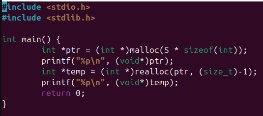{width="5.572916666666667in" height="2.46875in"}

Рис 10. Код програми 45.с.

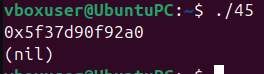{width="2.75in" height="0.7708333333333334in"}

Рис 11. Виконання програми.

### **Відповідь на запитання:**

Якщо realloc(3) не зможе виділити пам'ять, то пам'ть не буде виділена.

## **Завдання 4.6:** 

Якщо realloc(3) викликати з NULL або розміром 0, що станеться? Напишіть
тестовий випадок.

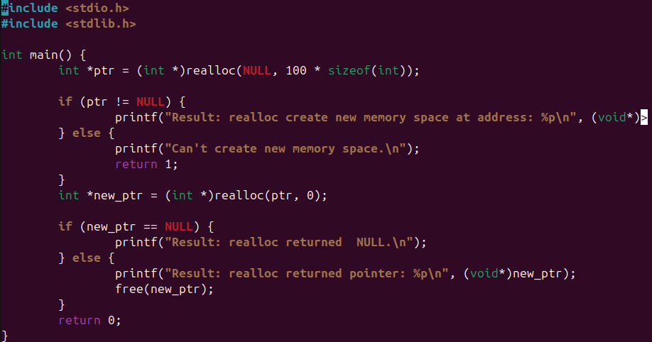{width="6.267716535433071in"
height="3.2916666666666665in"}

Рис 12. Код програми 46.с.

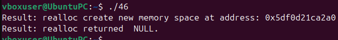{width="6.267716535433071in" height="0.75in"}

Рис 13. Виконання програми.

### **Відповідь на запитання:**

Якщо realloc(3) викликати з NULL, то програма виділить пам'ть під цей
об'єкт. Якщо розмір 0, в такому випадку, пам'ять виділитися не зможе.

## **Завдання 4.7:** 

Перепишіть наступний код, використовуючи reallocarray(3):

struct sbar \*ptr, \*newptr;

ptr = calloc(1000, sizeof(struct sbar));

newptr = realloc(ptr, 500\*sizeof(struct sbar));

Порівняйте результати виконання з використанням ltrace.

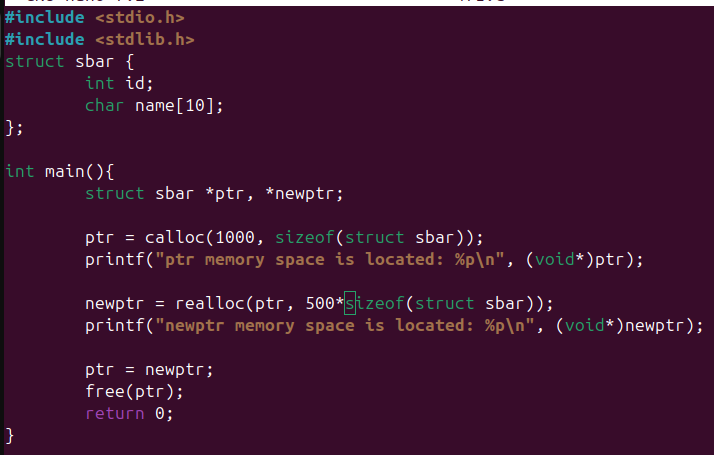{width="6.267716535433071in" height="4.0in"}

Рис 14. Код програми 471.с, код з прикладу.

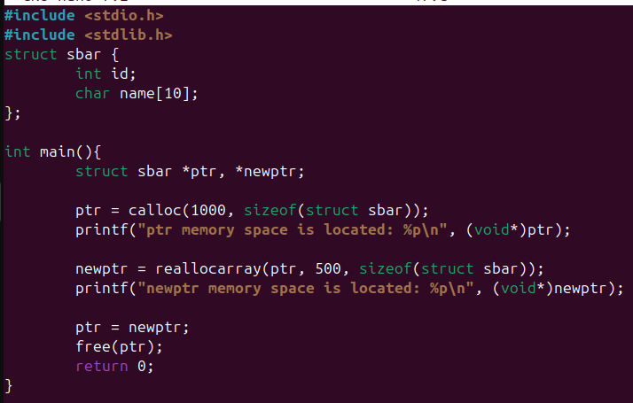{width="6.267716535433071in" height="4.0in"}

Рис 15. Код програми 47.с, код з reallocarray.

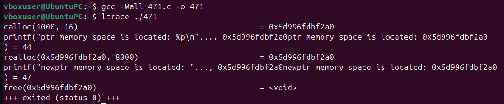{width="6.267716535433071in"
height="1.3055555555555556in"}

Рис 16. Виконання програми 471.c.

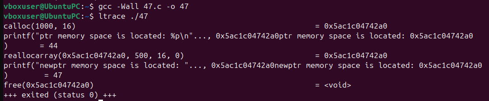{width="6.267716535433071in"
height="1.3055555555555556in"}

Рис 17. Виконання програми 47.c.

## **Завдання ПО ВАРІАНТАХ**

10\. Дослідити поведінку realloc() при розширенні блоку. Виявити випадки
копіювання та "розширення на місці".

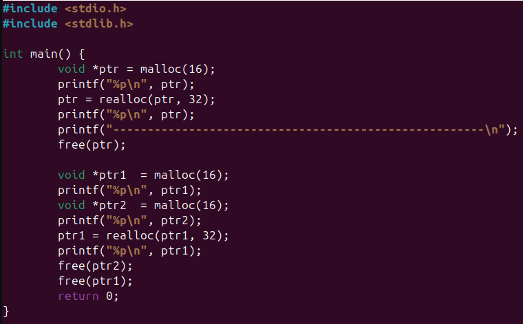{width="6.267716535433071in"
height="3.888888888888889in"}

Рис 18. Код програми 47.с, код з reallocarray.

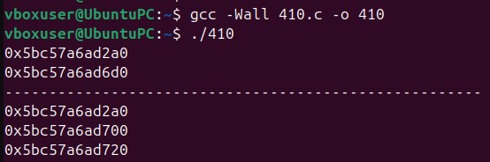{width="5.770833333333333in"
height="1.9166666666666667in"}

Рис 19. Виконання програми 47.c.
