## **Завдання 1.**
Використайте popen(), щоб передати вивід команди rwho (команда UNIX) до more (команда UNIX) у програмі на C.
## **Вирішення:**
## 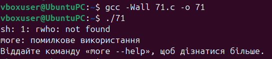** 	Програма виконує дві системні команди за допомогою функції popen. Вона також перевіряє, чи успішно виконались ці команди.
-----

## **Завдання 2.**
Напишіть програму мовою C, яка імітує команду ls -l в UNIX — виводить список усіх файлів у поточному каталозі та перелічує права доступу тощо.
## **Вирішення:**
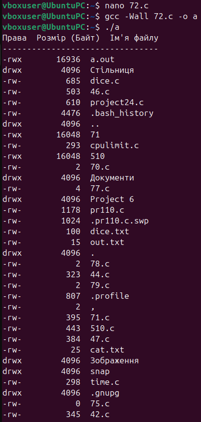

Ця програма читає вміст поточної директорії та виводить інформацію про кожен знайдений файл або піддиректорію у вигляді таблиці. Для кожного елемента відображаються його права доступу, розмір у байтах та ім'я. 

-----
## **Завдання 3.**
Напишіть програму, яка друкує рядки з файлу, що містять слово, передане як аргумент програми (проста версія утиліти grep в UNIX).
## **Вирішення:**
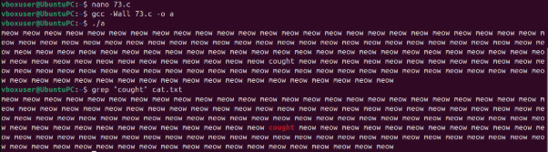

Програма читає файл з назвою cat.txt рядок за рядком і використовує регулярні вирази, щоб знайти та вивести лише ті рядки, які містять слово cought.

-----
## **Завдання 4.**
Напишіть програму, яка виводить список файлів, заданих у вигляді аргументів, з зупинкою кожні 20 рядків, доки не буде натиснута клавіша (спрощена версія утиліти more в UNIX).
## **Вирішення: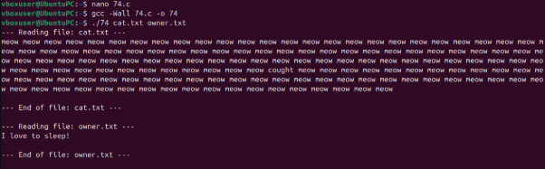**
Це утиліта для читання текстових файлів, імена яких передаються як аргументи командного рядка. Вона виводить вміст файлів на екран, роблячи паузу та виводячи повідомлення --More (Press Enter)-- кожні 20 рядків, очікуючи натискання клавіші Enter для продовження.

-----
## **Завдання 5.**
Напишіть програму, яка перелічує всі файли в поточному каталозі та всі файли в підкаталогах.

## **Вирішення: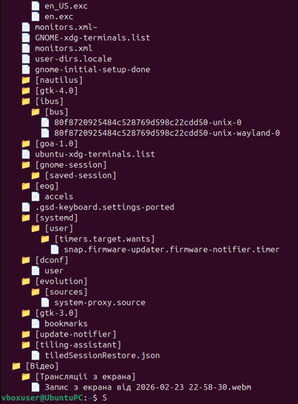**
Програма рекурсивно обходить поточний каталог і всі його підкаталоги. Вона виводить ієрархічне дерево файлової системи, використовуючи відступи та спеціальні символи. 

-----
## **Завдання 6.**
` `Напишіть програму, яка перелічує лише підкаталоги у алфавітному порядку.

## **Вирішення:**
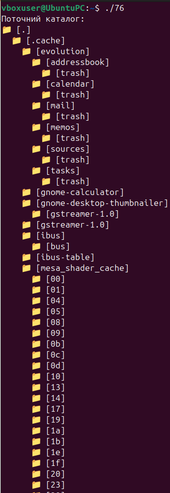

Ця програма схожа на попередню, але вона рекурсивно виводить лише ієрархію *піддиректорій* поточного каталогу. Важливою особливістю є те, що імена піддиректорій на кожному рівні сортуються за алфавітом перед виведенням.

-----
## **Завдання 7.**
Напишіть програму, яка показує користувачу всі його/її вихідні програми на C, а потім в інтерактивному режимі запитує, чи потрібно надати іншим дозвіл на читання (read permission); у разі ствердної відповіді — такий дозвіл повинен бути наданий.
## **Вирішення: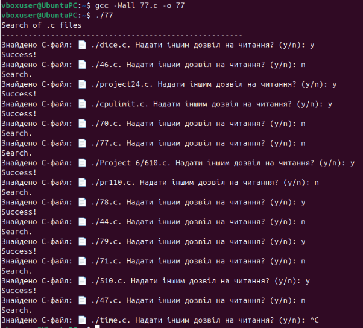**
Програма рекурсивно шукає файли з розширенням .c у поточному каталозі та його підкаталогах. Для кожного знайденого файлу вона запитує користувача, чи потрібно надати іншим користувачам дозвіл на читання цього файлу, і змінює права доступу (chmod), якщо користувач погоджується.

-----
## **Завдання 8.**
Напишіть програму, яка надає користувачу можливість видалити будь-який або всі файли у поточному робочому каталозі. Має з’являтися ім’я файлу з запитом, чи слід його видалити.
## **Вирішення:**
## 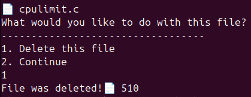
Ця програма перебирає всі файли у поточному каталозі. Для кожного файлу вона запитує користувача, чи потрібно його видалити, чи продовжити далі. Якщо вибрано видалення, файл знищується.

-----
## **Завдання 9.**
Напишіть програму на C, яка вимірює час виконання фрагмента коду в мілісекундах.
## **Вирішення:**
## 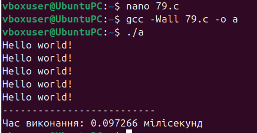
Програма вимірює час виконання невеликого блоку коду. Вона використовує функцію clock\_gettime для фіксації часу початку та кінця, а потім обчислює і виводить загальний час виконання у мілісекундах.

-----
## **Завдання 10.**
Напишіть програму мовою C для створення послідовності випадкових чисел з плаваючою комою у діапазонах:\
` `(a) від 0.0 до 1.0\
` `(b) від 0.0 до n, де n — будь-яке дійсне число з плаваючою точкою.\
` `Початкове значення генератора випадкових чисел має бути встановлене так, щоб гарантувати унікальну послідовність.

Примітка: використання прапорця -Wall під час компіляції є обов’язковим.

## **Вирішення: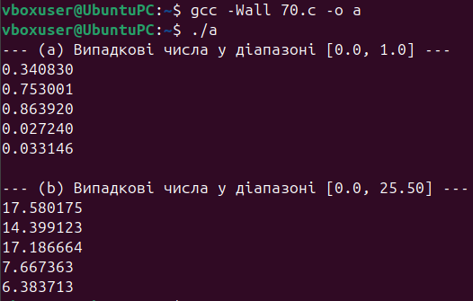**
## Ця програма генерує та виводить випадкові числа. Вона виводить 5 випадкових чисел у діапазоні від 0.0 до 1.0, а потім ще 5 випадкових чисел у діапазоні від 0.0 до заданого значення n.
-----
## **Завдання за варіантом**
10\. Створіть утиліту, яка виводить таблицю відкритих файлів усіх процесів у системі без доступу до /proc.
## **Вирішення: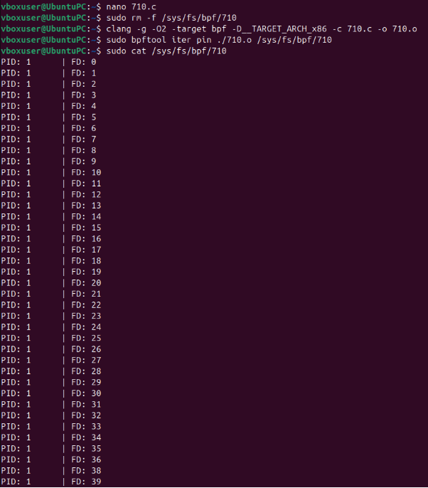**
Цей код є eBPF-програмою, яка працює як ітератор для відкритих файлів у системі. Під час виконання програма перевіряє, чи не завершилася ітерація, і для кожного відкритого файлу виводить ідентифікатор процесу та номер відповідного файлового дескриптора. У кінці коду також визначається сумісна ліцензія, що є обов'язковою вимогою для успішного завантаження eBPF-програм у ядро Linux.

-----
