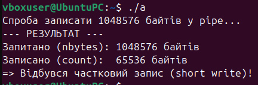
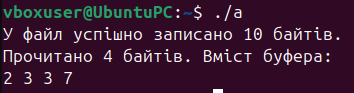
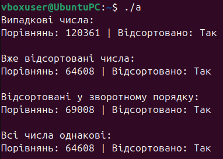
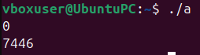

## **Завдання 1.**
# Чи може виклик count = write(fd, buffer, nbytes); повернути в змінній count значення, відмінне від nbytes? Якщо так, то чому? Наведіть робочий приклад програми, яка демонструє вашу відповідь.
## **Вирішення:**
##  	****
Зображення 1: Демонстрація часткового запису (short write) при спробі записати 1 МБ даних у неблокуючий канал (pipe).

Програма створює неблокуючий канал та намагається записати в нього великий обсяг даних за один системний виклик write. Оскільки буфер каналу в ядрі ОС має обмежений розмір, програма демонструє, як обробити ситуацію, коли записується лише частина від запитаного обсягу байтів.
## **Відповідь на запитання:**
Так, може. Тому, що я написав програму у не блокуючому каналі. Через це ядро системи заповнило буфер і вивело максимально можливе число в консоль.

-----

## **Завдання 2.**
# Є файл, дескриптор якого — fd. Файл містить таку послідовність байтів: 4, 5, 2, 2, 3, 3, 7, 9, 1, 5. У програмі виконується наступна послідовність системних викликів:
# lseek(fd, 3, SEEK\_SET);
# read(fd, &buffer, 4);
де виклик lseek переміщує покажчик на третій байт файлу. Що буде містити буфер після завершення виклику read? Наведіть робочий приклад програми, яка демонструє вашу відповідь.
## **Вирішення:**

Зображення 2: Читання заданої послідовності байтів після позиціонування файлового покажчика функцією lseek.

Програма створює тимчасовий файл і записує в нього масив із десяти байтів: 4, 5, 2, 2, 3, 3, 7, 9, 1, 5. Після цього використовується функція lseek, щоб перемістити файловий покажчик на вказану позицію, а потім read зчитує 4 байти в пам'ять програми для подальшого виведення на екран.
## **Відповідь на запитання:**
Буфер міститеме послідовність байтів; 2, 3, 3, 7.

-----
## **Завдання 3.**
Бібліотечна функція qsort призначена для сортування даних будь-якого типу. Для її роботи необхідно підготувати функцію порівняння, яка викликається з qsort кожного разу, коли потрібно порівняти два значення.\
` `Оскільки значення можуть мати будь-який тип, у функцію порівняння передаються два вказівники типу void\* на елементи, що порівнюються.
===========================================================================================================================================================================================================================================
- # Напишіть програму, яка досліджує, які вхідні дані є найгіршими для алгоритму швидкого сортування. Спробуйте знайти кілька масивів даних, які змушують qsort працювати якнайповільніше. Автоматизуйте процес експериментування так, щоб підбір і аналіз вхідних даних виконувалися самостійно.
- # Придумайте і реалізуйте набір тестів для перевірки правильності функції qsort.
## **Вирішення:**
## 
Зображення 3: Результати експерименту: порівняння кількості операцій функції qsort для різних патернів вхідних даних.

Програма тестує ефективність бібліотечної функції швидкого сортування qsort мови C. Вона створює масиви однакового розміру, але з різними патернами даних: повністю випадкові числа, вже відсортовані за зростанням, відсортовані за спаданням та масиви, що складаються з однакових чисел. Для кожного масиву підраховується кількість виконаних порівнянь.

-----
## **Завдання 4.**
# Виконайте наступну програму на мові програмування С:
# int main() {
#   int pid;
#   pid = fork();
#   printf("%d\n", pid);
# }
# Завершіть цю програму. Припускаючи, що виклик fork() був успішним, яким може бути результат виконання цієї програми?
## **Вирішення:**

Зображення 4: Демонстрація виведення результатів роботи батьківського та дочірнього процесів після системного виклику fork().

Надана мініатюрна програма викликає системну функцію fork(), яка створює точну копію поточного процесу. Після цього обидва процеси паралельно продовжують виконання з наступного рядка коду і виводять значення змінної pid на екран.

-----
## **Завдання за варіантом:**
10\. Побудуйте таблицю з часами виконання qsort() для різних схем вхідних даних і поясніть сплески в часі.
## **Вирішення:**

|**Схема вхідних даних**|**Типова часова складність**|**Кількість порівнянь**|**Оцінка швидкодії**|
| :- | :- | :- | :- |
|Випадкові числа|O(NlogN)|≈N log2​ N|Найшвидше|
|Вже відсортовані|O(N^2)|≈N^2/2|Дуже повільно|
|Зворотний порядок|O(N^2)|≈N^2/2|Дуже повільно|
|Всі числа однакові|O(N^2)|≈N^2/2|Найгірший випадок|

