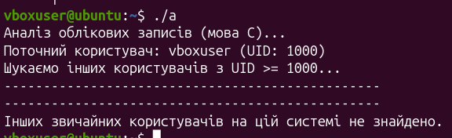
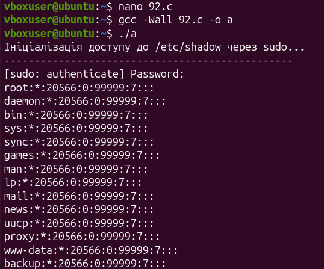
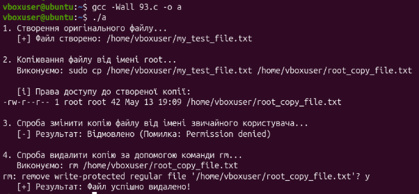
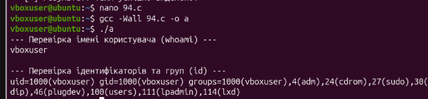
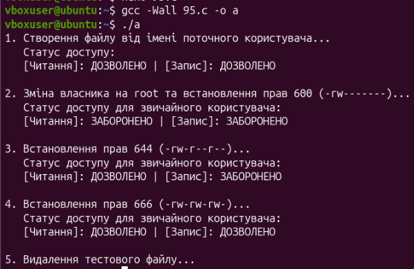
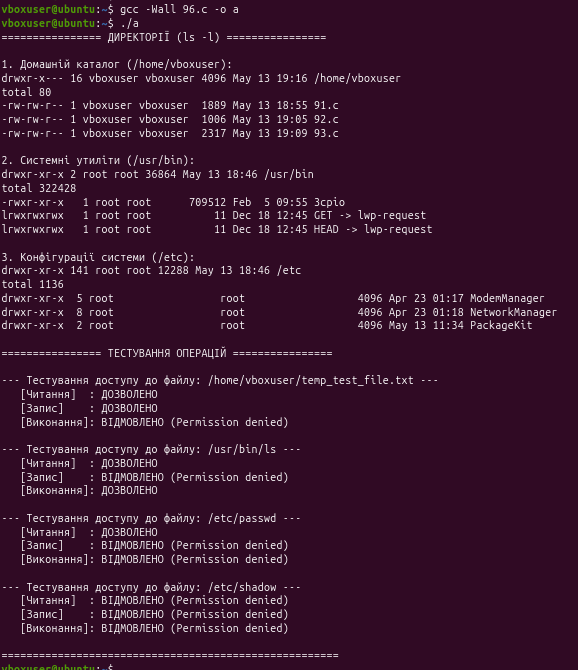

Практична робота №6

-----
## **Завдання 1:** 
Напишіть програму, яка читає файл /etc/passwd за допомогою команди getent passwd, щоб дізнатись, які облікові записи визначені на вашому комп’ютері.\
` `Програма повинна визначити, чи є серед них звичайні користувачі (ідентифікатори UID повинні бути більші за 500 або 1000, залежно від вашого дистрибутива), окрім вас.
## **Код:** 
#include <stdio.h>

#include <stdlib.h>

#include <string.h>

#include <unistd.h>

#include <sys/types.h>

#include <pwd.h>

#define MIN\_UID 1000

int main() {

`        `uid\_t current\_uid = getuid();

`        `struct passwd \*pw = getpwuid(current\_uid);

`        `char current\_user[256] = {0};

`        `if (pw != NULL) {

`            `strncpy(current\_user, pw->pw\_name, sizeof(current\_user) - 1);

`        `} else {

`            `perror("Не вдалося отримати дані поточного користувача");

`            `return 1;

`        `}

`        `printf("Аналіз облікових записів (мова C)...\n");

`        `printf("Поточний користувач: %s (UID: %d)\n", current\_user, current\_uid);

`        `printf("Шукаємо інших користувачів з UID >= %d...\n", MIN\_UID);

`        `printf("------------------------------------------------\n");

`        `FILE \*fp = popen("getent passwd", "r");

`        `if (fp == NULL) {

`            `perror("Помилка під час виклику popen");

`            `return 1;

`        `}

`        `char line[1024];

`        `int count = 0;

`        `while (fgets(line, sizeof(line), fp) != NULL) {

`            `char \*username = strtok(line, ":");

`            `char \*password = strtok(NULL, ":");

`            `char \*uid\_str = strtok(NULL, ":");

`            `if (username != NULL && uid\_str != NULL) {

`                    `int uid = atoi(uid\_str);

`                    `if (uid >= MIN\_UID && uid != 65534 && strcmp(username, current\_user) != 0) {

`                        `printf("- %s (UID: %d)\n", username, uid);

`                        `count++;

`            `}

`        `}

`    `}

`    `pclose(fp);

`    `printf("------------------------------------------------\n");

`    `if (count == 0) {

`        `printf("Інших звичайних користувачів на цій системі не знайдено.\n");

`    `} else {

`        `printf("Усього знайдено інших звичайних користувачів: %d\n", count);

`    `}

`    `return 0;

}
## **Робота програми: **
-----
## **Завдання 2:** 
Напишіть програму, яка виконує команду cat /etc/shadow від імені адміністратора, хоча запускається від звичайного користувача.\
` `(Ваша програма повинна робити необхідне, виходячи з того, що конфігурація системи дозволяє отримувати адміністративний доступ за допомогою відповідної команди.)

## **Код:** 
#include <stdio.h>

#include <stdlib.h>

#include <unistd.h>

#include <sys/types.h>

#include <sys/wait.h>

int main() {

`    `printf("Ініціалізація доступу до /etc/shadow через sudo...\n");

`    `printf("------------------------------------------------\n");

`    `pid\_t pid = fork();

`    `if (pid < 0) {

`                `perror("Помилка під час виклику fork");

`            `return 1;

`        `} else if (pid == 0) {

`            `execlp("sudo", "sudo", "cat", "/etc/shadow", NULL);

`               `perror("Помилка виконання execlp");

`            `exit(1);

`        `} else {

`            `int status;

`            `waitpid(pid, &status, 0);

`            `printf("------------------------------------------------\n");

`            `if (WIFEXITED(status)) {

`                    `printf("Команда sudo завершилася з кодом: %d\n", WEXITSTATUS(status));

`            `} else {

`                    `printf("Дочірній процес завершився нештатно.\n");

`            `}

`        `}

`    `return 0;

}
## **Робота програми: **
-----
## **Завдання 3:** 
Напишіть програму, яка від імені root копіює файл, який вона перед цим створила від імені звичайного користувача. Потім вона повинна помістити копію у домашній каталог звичайного користувача.\
` `Далі, використовуючи звичайний обліковий запис, програма намагається змінити файл і зберегти зміни. Що відбудеться?\
` `Після цього програма намагається видалити цей файл за допомогою команди rm. Що відбудеться?
## **Код:** 
#include <stdio.h>

#include <stdlib.h>

#include <string.h>

#include <errno.h>

int main() {

`    `char \*home = getenv("HOME");

`    `if (home == NULL) {

`        `fprintf(stderr, "Помилка: не вдалося знайти домашній каталог.\n");

`        `return 1;

`    `}

`    `char orig\_path[512], copy\_path[512];

`    `snprintf(orig\_path, sizeof(orig\_path), "%s/my\_test\_file.txt", home);

`    `snprintf(copy\_path, sizeof(copy\_path), "%s/root\_copy\_file.txt", home);

`    `printf("1. Створення оригінального файлу...\n");

`    `FILE \*f\_orig = fopen(orig\_path, "w");

`    `if (f\_orig != NULL) {

`        `fputs("Це оригінальний текст.\n", f\_orig);

`        `fclose(f\_orig);

`        `printf("   [+] Файл створено: %s\n", orig\_path);

`    `} else {

`        `perror("   [-] Помилка створення файлу");

`        `return 1;

`    `}

`    `printf("\n2. Копіювання файлу від імені root...\n");

`    `char cmd[2048];

`    `snprintf(cmd, sizeof(cmd), "sudo cp %s %s", orig\_path, copy\_path);

`    `printf("   Виконуємо: %s\n", cmd);

`    `system(cmd);

`    `printf("\n   [i] Права доступу до створеної копії:\n   ");

`    `snprintf(cmd, sizeof(cmd), "ls -l %s", copy\_path);

`    `system(cmd);

`    `printf("\n3. Спроба змінити копію файлу від імені звичайного користувача...\n");

`    `FILE \*f\_copy = fopen(copy\_path, "a");

`    `if (f\_copy == NULL) {

`        `printf("   [-] Результат: Відмовлено (Помилка: %s)\n", strerror(errno));

`    `} else {

`        `printf("   [+] Результат: Успіх!\n");

`        `fputs("Додатковий рядок від користувача.\n", f\_copy);

`        `fclose(f\_copy);

`    `}

`    `printf("\n4. Спроба видалити копію за допомогою команди rm...\n");

`    `snprintf(cmd, sizeof(cmd), "rm %s", copy\_path);

`    `printf("   Виконуємо: %s\n", cmd);

`    `int rm\_status = system(cmd);

`    `if (rm\_status == 0) {

`        `printf("   [+] Результат: Файл успішно видалено!\n");

`    `} else {

`        `printf("   [-] Результат: Не вдалося видалити файл.\n");

`    `}

`    `remove(orig\_path);

`    `return 0;

}
## **Робота програми: **
-----
## **Завдання 4:** 
Напишіть програму, яка по черзі виконує команди whoami та id, щоб перевірити стан облікового запису користувача, від імені якого вона запущена.\
` `Є ймовірність, що команда id виведе список різних груп, до яких ви належите. Програма повинна це продемонструвати.

## **Код:** 
#include <stdio.h>

#include <stdlib.h>

int main() {

`    `printf("--- Перевірка імені користувача (whoami) ---\n");

`    `if (system("whoami") == -1) {

`        `perror("Помилка виконання whoami");

`        `return 1;

`    `}

`    `printf("\n--- Перевірка ідентифікаторів та груп (id) ---\n");

`    `if (system("id") == -1) {

`        `perror("Помилка виконання id");

`        `return 1;

`    `}

`    `return 0;

}
## **Робота програми: **
-----
## **Завдання 5:** 
Напишіть програму, яка створює тимчасовий файл від імені звичайного користувача. Потім від імені суперкористувача використовує команди chown і chmod, щоб змінити тип володіння та права доступу.\
` `Програма повинна визначити, в яких випадках вона може виконувати читання та запис файлу, використовуючи свій обліковий запис.
## **Код:** 
#include <stdio.h>

#include <stdlib.h>

#include <unistd.h>

void check\_access(const char \*filepath) {

`    `int can\_read = access(filepath, R\_OK);

`    `int can\_write = access(filepath, W\_OK);

`    `printf("   [Читання]: %s | [Запис]: %s\n", 

`           `(can\_read == 0) ? "ДОЗВОЛЕНО" : "ЗАБОРОНЕНО",

`           `(can\_write == 0) ? "ДОЗВОЛЕНО" : "ЗАБОРОНЕНО");

}

int main() {

`    `const char \*filepath = "/tmp/test\_perms.txt";

`    `char cmd[256];

`    `printf("1. Створення файлу від імені поточного користувача...\n");

`    `FILE \*f = fopen(filepath, "w");

`    `if (!f) {

`        `perror("Не вдалося створити файл");

`        `return 1;

`    `}

`    `fputs("Тестові дані.\n", f);

`    `fclose(f);

`    `printf("   Статус доступу:\n");

`    `check\_access(filepath);

`    `printf("\n2. Зміна власника на root та встановлення прав 600 (-rw-------)...\n");

`    `snprintf(cmd, sizeof(cmd), "sudo chown root:root %s && sudo chmod 600 %s", filepath, filepath);

`    `system(cmd);

`    `printf("   Статус доступу для звичайного користувача:\n");

`    `check\_access(filepath);

`    `printf("\n3. Встановлення прав 644 (-rw-r--r--)...\n");

`    `snprintf(cmd, sizeof(cmd), "sudo chmod 644 %s", filepath);

`    `system(cmd);

`    `printf("   Статус доступу для звичайного користувача:\n");

`    `check\_access(filepath);

`    `printf("\n4. Встановлення прав 666 (-rw-rw-rw-)...\n");

`    `snprintf(cmd, sizeof(cmd), "sudo chmod 666 %s", filepath);

`    `system(cmd);

`    `printf("   Статус доступу для звичайного користувача:\n");

`    `check\_access(filepath);

`    `printf("\n5. Видалення тестового файлу...\n");

`    `snprintf(cmd, sizeof(cmd), "sudo rm %s", filepath);

`    `system(cmd);

`    `return 0;

}
## **Робота програми: **
-----
## **Завдання 6:** 
Напишіть програму, яка виконує команду ls -l, щоб переглянути власника і права доступу до файлів у своєму домашньому каталозі, в /usr/bin та в /etc.\
` `Продемонструйте, як ваша програма намагається обійти різні власники та права доступу користувачів, а також здійснює спроби читання, запису та виконання цих файлів.
## **Код:** 
#include <stdio.h>

#include <stdlib.h>

#include <unistd.h>

#include <errno.h>

#include <string.h>

void test\_file\_ops(const char \*filepath) {

`    `printf("\n--- Тестування доступу до файлу: %s ---\n", filepath);

`    `FILE \*f\_read = fopen(filepath, "r");

`    `if (f\_read) {

`        `printf("   [Читання]  : ДОЗВОЛЕНО\n");

`        `fclose(f\_read);

`    `} else {

`        `printf("   [Читання]  : ВІДМОВЛЕНО (%s)\n", strerror(errno));

`    `}

`    `FILE \*f\_write = fopen(filepath, "a");

`    `if (f\_write) {

`        `printf("   [Запис]    : ДОЗВОЛЕНО\n");

`        `fclose(f\_write);

`    `} else {

`        `printf("   [Запис]    : ВІДМОВЛЕНО (%s)\n", strerror(errno));

`    `}

`    `if (access(filepath, X\_OK) == 0) {

`        `printf("   [Виконання]: ДОЗВОЛЕНО\n");

`    `} else {

`        `printf("   [Виконання]: ВІДМОВЛЕНО (%s)\n", strerror(errno));

`    `}

}

int main() {

`    `char \*home = getenv("HOME");

`    `if (home == NULL) {

`        `fprintf(stderr, "Помилка: не вдалося визначити домашній каталог.\n");

`        `return 1;

`    `}

`    `char cmd[512];

`    `printf("================ ДИРЕКТОРІЇ (ls -l) ================\n");

`    `printf("\n1. Домашній каталог (%s):\n", home);

`    `snprintf(cmd, sizeof(cmd), "ls -ld %s && ls -l %s | head -n 4", home, home);

`    `system(cmd);

`    `printf("\n2. Системні утиліти (/usr/bin):\n");

`    `system("ls -ld /usr/bin && ls -l /usr/bin | head -n 4");

`    `printf("\n3. Конфігурації системи (/etc):\n");

`    `system("ls -ld /etc && ls -l /etc | head -n 4");

`    `printf("\n================ ТЕСТУВАННЯ ОПЕРАЦІЙ ================\n");

`    `char my\_file[512];

`    `snprintf(my\_file, sizeof(my\_file), "%s/temp\_test\_file.txt", home);

`    `FILE \*tmp = fopen(my\_file, "w");

`    `if(tmp) {

`        `fputs("Дані", tmp);

`        `fclose(tmp);

`    `}

`    `test\_file\_ops(my\_file);

`    `remove(my\_file);

`    `test\_file\_ops("/usr/bin/ls");

`    `test\_file\_ops("/etc/passwd");

`    `test\_file\_ops("/etc/shadow");

`    `printf("\n======================================================\n");

`    `return 0;

}
## **Робота програми: **
-----
## **Завдання за варіантом:** 
10\. Визначте, які приховані механізми можуть дати доступ до закритого ресурсу без зміни прав доступу.
## **Визначення:** 
Біти SUID/SGIN, подача файлових дескрипторів, доступ на рівні ядра

-----
