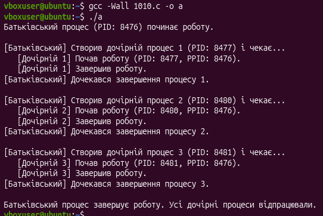

Практична робота №10

-----
## **Завдання за варіантом:** 
Напишіть програму, яка читає файл /etc/passwd за допомогою команди getent passwd, щоб дізнатись, які облікові записи визначені на вашому комп’ютері.\
` `Програма повинна визначити, чи є серед них звичайні користувачі (ідентифікатори UID повинні бути більші за 500 або 1000, залежно від вашого дистрибутива), окрім вас.
## **Код:** 
#include <stdio.h>

#include <stdlib.h>

#include <unistd.h>

#include <sys/types.h>

#include <sys/wait.h>

int main() {

`    `int num\_iterations = 3;

`    `printf("Батьківський процес (PID: %d) починає роботу.\n\n", getpid());

`    `for (int i = 1; i <= num\_iterations; i++) {

`        `pid\_t pid = fork();

`        `if (pid < 0) {

`            `perror("Помилка під час виклику fork");

`            `exit(1);

`        `} 

`        `else if (pid == 0) {

`            `printf("   [Дочірній %d] Почав роботу (PID: %d, PPID: %d).\n", i, getpid(), getppid());

`            `sleep(1); 

`            `printf("   [Дочірній %d] Завершив роботу.\n", i);

`            `exit(0); 

`        `} 

`        `else {

`            `printf("[Батьківський] Створив дочірній процес %d (PID: %d) і чекає...\n", i, pid);

`            `int status;

`            `waitpid(pid, &status, 0);

`            `printf("[Батьківський] Дочекався завершення процесу %d.\n\n", i);

`        `}

`    `}

`    `printf("Батьківський процес завершує роботу. Усі дочірні процеси відпрацювали.\n");

`    `return 0;

}
## **Робота програми:**
## ** 
-----
