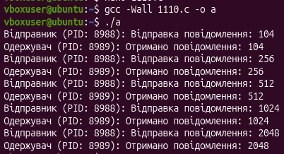

Практична робота №11

-----
## **Завдання за варіантом:** 
Реалізуйте систему обміну повідомленнями між двома процесами, де кожне повідомлення кодується у sigval.sival\_int, і процес отримує повідомлення через sigqueue
## **Код:** 
#include <stdio.h>

#include <stdlib.h>

#include <unistd.h>

#include <signal.h>

#include <sys/types.h>

#include <sys/wait.h>

void receiver\_handler(int signo, siginfo\_t \*info, void \*context) {

`    `if (signo == SIGUSR1) {

`        `printf("Одержувач (PID: %d): Отримано повідомлення: %d\n", getpid(), info->si\_value.sival\_int);

`    `}

}

int main() {

`    `struct sigaction sa;

`    `sa.sa\_sigaction = receiver\_handler;

`    `sa.sa\_flags = SA\_SIGINFO;

`    `sigemptyset(&sa.sa\_mask);

`    `if (sigaction(SIGUSR1, &sa, NULL) == -1) {

`        `perror("Помилка sigaction");

`        `exit(EXIT\_FAILURE);

`    `}

`    `pid\_t pid = fork();

`    `if (pid < 0) {

`        `perror("Помилка fork");

`        `exit(EXIT\_FAILURE);

`    `} 

`    `else if (pid == 0) {

`        `for (int i = 0; i < 5; i++) {

`            `pause();

`        `}

`        `exit(EXIT\_SUCCESS);

`    `} 

`    `else {

`        `union sigval value;

`        `int messages[] = {104, 256, 512, 1024, 2048};

`        `int num\_messages = sizeof(messages) / sizeof(messages[0]);

`        `for (int i = 0; i < num\_messages; i++) {

`            `sleep(1);

`            `value.sival\_int = messages[i];

`            `printf("Відправник (PID: %d): Відправка повідомлення: %d\n", getpid(), value.sival\_int);

`            `if (sigqueue(pid, SIGUSR1, value) == -1) {

`                `perror("Помилка sigqueue");

`            `}

`        `}

`        `wait(NULL);

`    `}

`    `return 0;

}
## **Робота програми:**
##  ****
-----
